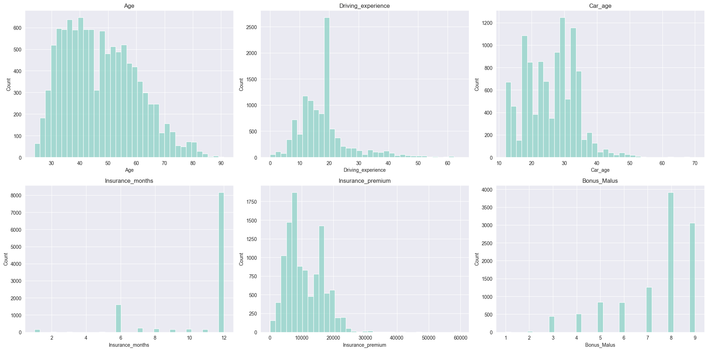
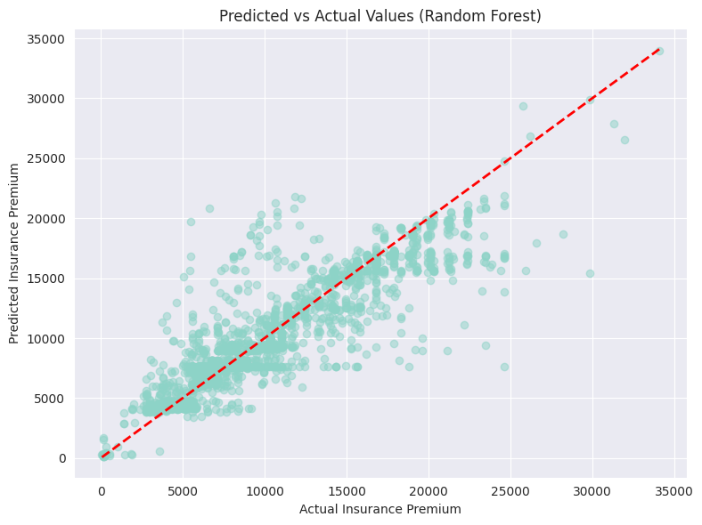
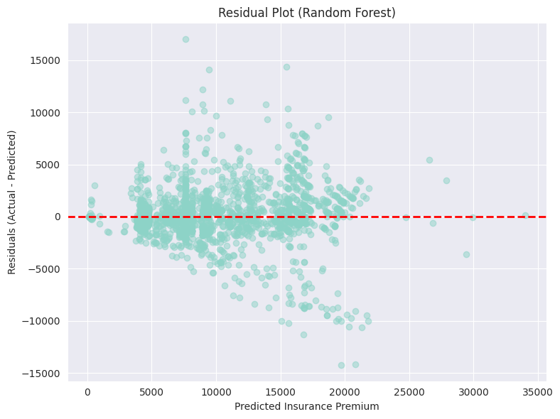
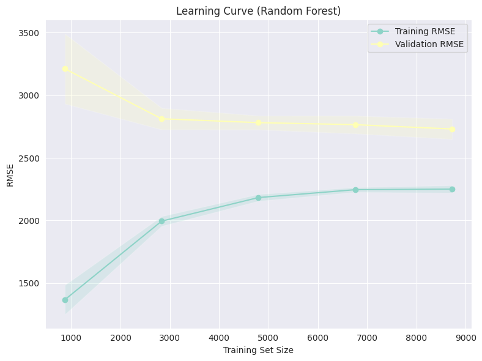

# Kazakhstan Car Insurance Pricing – Regression Modeling

## Overview

This project explores car insurance data from Kazakhstan to understand which factors influence insurance premiums and to build a machine learning model that predicts premium prices. It involves:

- Cleaning real-world insurance data
- Analyzing patterns and relationships
- Building and evaluating predictive models

The dataset includes detailed information about drivers, vehicles, and policies. The aim is to uncover meaningful insights and build a regression model that generalizes well.

## Project Structure

The project is organized into three main stages:

1. **Data Cleaning** – Preprocessing raw data for analysis and modeling
2. **Exploratory Data Analysis (EDA)** – Understanding relationships and distributions
3. **Modeling** – Building a regression model to predict insurance premiums

### Files Overview

| File | Description |
| --- | --- |
| `data_cleaning_rules.py` | Contains the `InsuranceDataCleaner` class, which encapsulates all preprocessing steps |
| `data_cleaning.ipynb` | Demonstrates and documents the full cleaning pipeline |
| `data_analysis.ipynb` | Contains exploratory data visualizations and insights |
| `modeling.ipynb` | Implements and evaluates regression models |


## Dataset Description

**Source**: [GitHub – Kazakhstan Road Accident Dataset](https://github.com/g0dfury/Kazakhstan-Road-Accident-Data-Analysis/blob/main/kz_road_accident.xlsx)

### Features include:

### Driver Information:

- `Age`, `Gender`, `Citizenship`, `Driving_experience`
- `Bonus_Malus` (risk score), `Privileges`

### Vehicle Information:

- `Brand`, `Model`, `Vehicle_type`, `Year_of_manufacture`
- `Color`, `Steering_wheel_location`

### Location & Policy Info:

- `City`, `Accident_region`, `Insurance_period`

### Financial Data:

- `Insurance_premium` (target), `Loss_amount`


## Project Goal

To predict car insurance premiums in Kazakhstan using features related to driver demographics, vehicle characteristics, and policy details.


## Data Cleaning Summary

Implemented via `InsuranceDataCleaner` in `data_cleaning_rules.py`. Key steps include:

- Dropped irrelevant/sparse columns
- Fixed logical inconsistencies (e.g., driving experience > age)
- Standardized vehicle types, colors, and brands
- Parsed insurance period to calculate duration in months
- Mapped cities to regions, filled missing values

Run cleaning with:

```python
from data_cleaning_rules import InsuranceDataCleaner
df = InsuranceDataCleaner("./data/raw_data.xlsx").clean()

```


## Key Insights from Data Analysis

Documented in `data_analysis.ipynb`. Highlights:

- Premiums increase with policy duration (6- and 12-month contracts have higher variance)
- More experienced drivers pay lower premiums on average
- Bimodal premium distribution is driven by subgroups within passenger cars
- Bonus-Malus score overlaps between risk groups – not a sole predictor
- Vehicle color and brand have minimal direct effect on premiums




## Model Performance Summary

Implemented in `modeling.ipynb` using Random Forest Regression (performed the best).

- Low variance in RMSE across cross-validation folds (≈ 2500–2800)
- Learning curve shows generalization improves with more data
- Residual plots reveal underestimation of high premiums (model bias)
- Feature importance ranks `Driving_experience`, `Car_age`, and `Insurance_months` highly



## Model Limitations and Areas for Further Development

### 1. **Underperformance on High-Premium Predictions**

- **Residual plots** show systematic underestimation in the upper premium quantiles.





### 2. **Heteroscedasticity and Model Variance**

- Learning curve and residual analysis reveal **heteroscedasticity**—model errors grow with predicted premium.
- Validation RMSE remains consistently higher than training RMSE, indicating some degree of **overfitting**.



## Conclusion

This project implemented a full-cycle machine learning pipeline for insurance premium prediction using real-world vehicle and policy data from Kazakhstan. It consisted of rigorous data cleaning, targeted exploratory data analysis, and supervised regression modeling.

Key outcomes include:

- A reusable data cleaning class (`InsuranceDataCleaner`) that handles structural inconsistencies, categorical normalization, and feature engineering.
- Insights from exploratory data analysis revealing key drivers of premium variation: insurance duration, driver experience, and Bonus-Malus score.
- A Random Forest Regressor trained on engineered features, validated via cross-validation, and assessed using RMSE and residual diagnostics.


